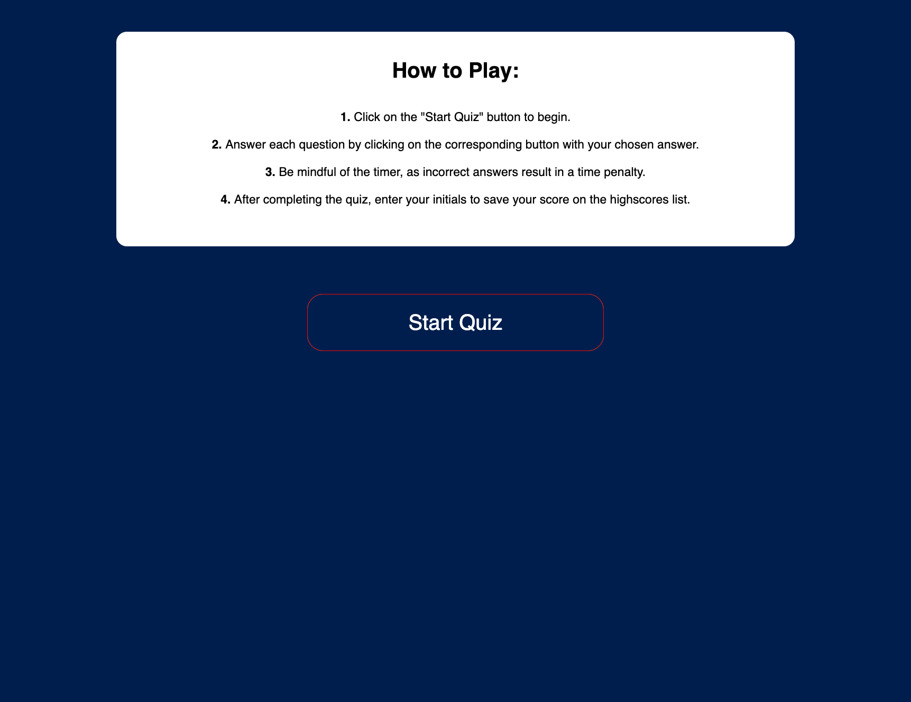

# JavaScript Quiz

## Overview

Welcome to the JavaScript Quiz! This interactive web-based quiz challenges your understanding of JavaScript, HTML, and CSS. Test your knowledge with multiple-choice questions and see how well you fare against the timer.

## Getting Started

## Gameplay

- Click the "Start Quiz" button to initiate the quiz.
- Answer each question within the time limit.
- Be cautious, as incorrect answers result in a time penalty.
- Save your score on the highscores list after completing the quiz.

## Features

- Dynamic quiz content generated from a set of questions.
- Timer functionality to add a time-based challenge.
- Highscores tracking to encourage replayability.

## Files and Structure

- **index.html:** HTML file containing the structure of the web page.
- **style.css:** External stylesheet for styling the web page.
- **script.js:** JavaScript files with functions for quiz logic.

## Contact

- **Jetnik Syla**
  - Email: sjetnik@gmail.com
  - Phone: + (1) 914-415-9578
  - GitHub Profile: [Jetnik Syla](https://github.com/JetnikSyla)

## Enjoy the Challenge!

Are you ready to dive into the world of JavaScript? Click ["Start Quiz"](https://jetniksyla.github.io/JS_basic_quizz/) and test your skills! Have fun and good luck!

## Project Screenshot

